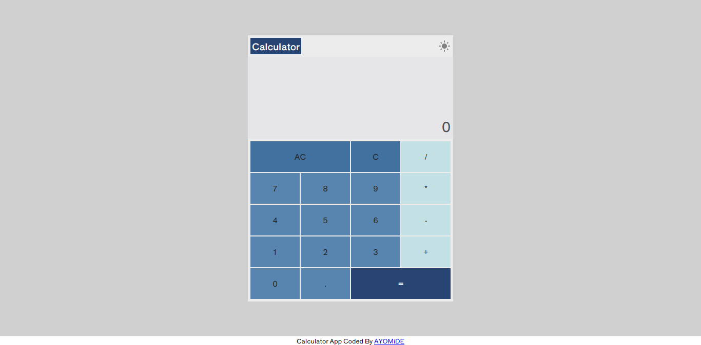
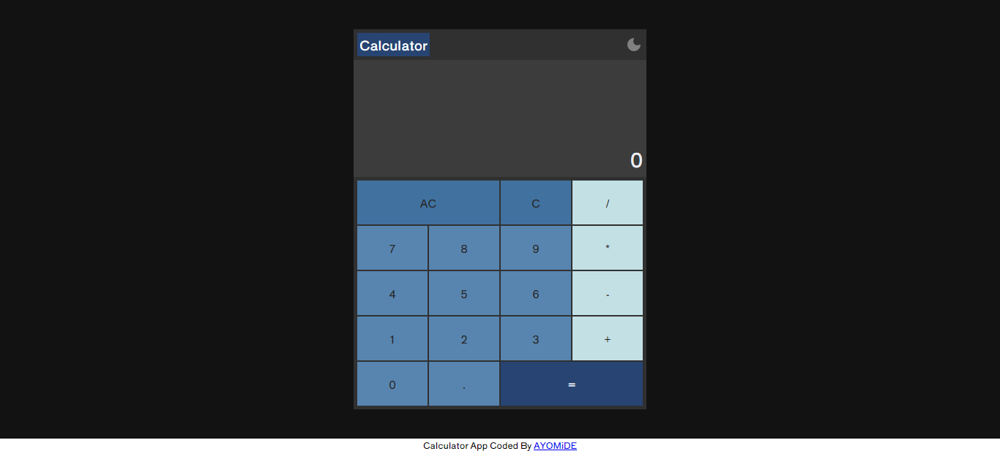

# Calculator App

This is a simple calculator app performs basic operations or functions such as addition, subtraction, multiplication and division. It can be used to solve basic arithmetic problems.

## Table of Contents

- [Overview](#overview)
  - [The Challenge](#the-challenge)
  - [Screenshot](#screenshot)
  - [Links](#links)
- [My Process](#my-process)
  - [Built With](#built-with)
  - [Continued Development](#continued-development)
- [Author](#author)

## Overview

### The Challenge

Users should be able to:

- View the optimal layout depending on their device's screen size
- Perform the following operations:
  - Addition
  - Subtraction
  - Multiplication
  - Division
- Change calculator app theme

### Screenshot
- Light Mode

- Dark Mode

### Links
- Solution URL: [Github](https://github.com/dahmide/calculator)
- Live Site URL: [Netlify](https://calculator-app.netlify.app) 

## My Process

### Built With

- HTML
- CSS custom properties
- Flexbox
- CSS Grid
- Vanilla Javascript

### Continued Development
To be able to perform more complex operations such as:
- Logarithms
- Sine, cosine and tangents functions
- Scientific notation
- Binary functions

## Author
- Github - [@dahmide](https://github.com/dahmide)
- Twitter - [@blarrklad](https://twitter.com/blarrklad)
- Instagram - [@blarrklad](https://instagram.com/blarrklad)
